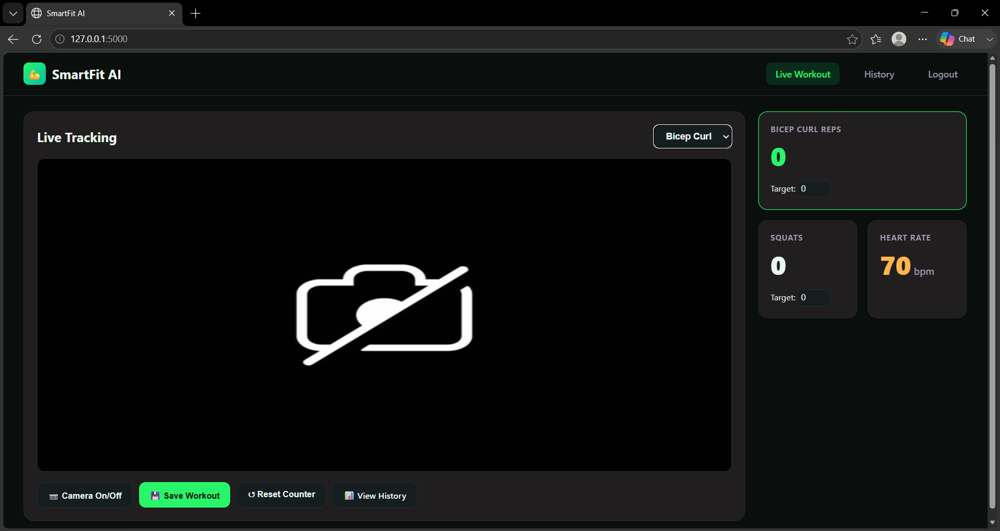
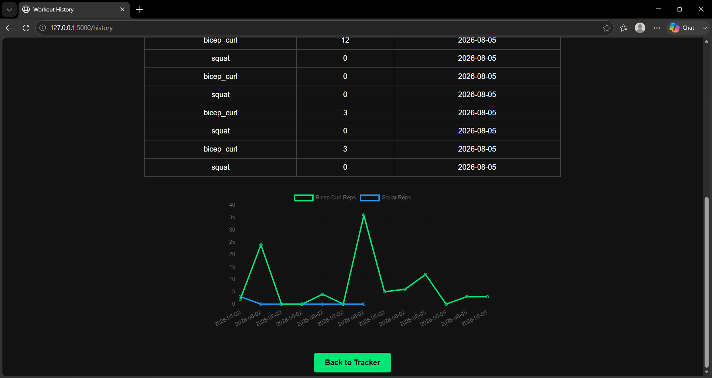

# SmartFit AI - Real-Time Workout Analysis System

A full-stack, computer vision-based fitness tracker that uses live pose estimation to count 
exercise repetitions, calculate joint angles, and track workout metrics in real time 
through a web interface — with secure multi-user support.

## Features

- **Real-time pose detection** using MediaPipe's Pose Landmarker (33 body landmarks)
- **Confidence-based filtering** — skips angle calculations when landmark visibility 
  is low, preventing false rep counts or incorrect readings from unreliable detections
- **Live joint angle calculation** using vector math (atan2-based)
- **Automatic rep counting** via a finite state machine (tracks up/down motion cycles)
- **Full-body skeleton overlay** rendered live on the video feed
- **Multi-exercise support** — bicep curls (both arms) and squats, with an exercise selector
- **Camera on/off toggle**, with proper hardware release when paused
- **User authentication** — secure registration and login with hashed passwords 
  (Werkzeug), session-based access control, and protected routes
- **Per-user workout history** — each user's saved sessions are private to their account
- **Web-based interface** built with Flask, streaming live video via MJPEG
- **Workout history storage** using MySQL, with a visual progress chart (Chart.js)
- **Simulated smartwatch integration** — heart rate data generated with realistic 
  drift patterns (real hardware integration planned as a future enhancement)
- **Live-updating stats** (reps, squats, heart rate) via JavaScript fetch + Flask JSON API
- **Form feedback** — evaluates squat depth and curl extension, giving coaching-style 
  messages (e.g., "Great depth!", "Curl higher for full range") rather than just counting reps
- **Audio feedback** — a short beep plays automatically each time a rep is counted


## Tech Stack

- **Backend:** Python, Flask
- **Computer Vision:** OpenCV, MediaPipe (Tasks API)
- **Database:** MySQL
- **Auth:** Flask sessions, Werkzeug password hashing
- **Frontend:** HTML, CSS, JavaScript, Chart.js
- **Other:** python-dotenv (secure credential management)

## Screenshots

### Live Tracker


### Workout History


## How It Works

1. Users register and log in; sessions control access to the tracker
2. Webcam frames are captured with OpenCV
3. Each frame is processed by MediaPipe's Pose Landmarker to detect 33 body landmarks
4. Depending on the selected exercise, relevant joint coordinates are extracted 
   (shoulder-elbow-wrist for arms, hip-knee-ankle for squats)
5. A state machine tracks the angle to detect complete rep cycles
6. Results are overlaid on the video and streamed live to a browser via Flask
7. Workout data is saved to MySQL tied to the logged-in user, and viewable later 
   on a personal history page with a progress chart

## Setup & Installation

1. Clone the repository:

git clone https://github.com/PraveenkumarTeli/smartfit-AI.git
cd smartfit-AI

2. Install dependencies:

pip install flask opencv-python mediapipe mysql-connector-python python-dotenv

3. Set up MySQL — create a database named `smartfit_db` with two tables (see schema below)

4. Create a `.env` file in the project root with:

DB_PASSWORD=your_mysql_password
SECRET_KEY=any_long_random_string

5. Run the app:

python app.py

6. Open `http://127.0.0.1:5000` in your browser — you'll be prompted to register/log in first

## Database Schema

```sql
CREATE TABLE users (
    id INT AUTO_INCREMENT PRIMARY KEY,
    username VARCHAR(50) UNIQUE,
    password VARCHAR(255)
);

CREATE TABLE workouts (
    id INT AUTO_INCREMENT PRIMARY KEY,
    exercise VARCHAR(50),
    reps INT,
    date DATE,
    user_id INT
);
```

## Current Limitations & Future Improvements

- Smartwatch data is simulated due to hardware availability — real API 
  integration (Google Fit/Fitbit) planned
- Additional exercise types (push-ups, lunges) could be added using the 
- Duplicate username registration is handled gracefully with a friendly 
  error message displayed on the registration form
  same angle-based detection pattern
- Not yet deployed to a live server — currently runs locally

## Author

Built as a hands-on learning project to gain practical experience in computer 
vision, machine learning fundamentals, authentication/security, and full-stack development.